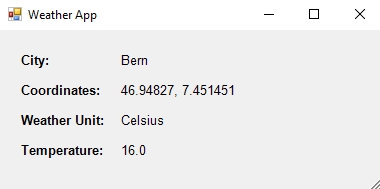

# Weather App

## Overview

The Weather App is a project developed for a school module, LB1, as part of an exam. This PowerShell script allows users to input a city, retrieve weather information from an API, and display it in a graphical user interface (GUI). The weather information includes details about the city, coordinates, temperature, and the selected temperature unit (°C or °F).

## Getting Started

To run the Weather App, follow these steps:

1. **Run the Script:** Execute the PowerShell script provided in this repository.

2. **Enter City:** The script will prompt you to enter the name of the city for which you want to retrieve weather information.

3. **Choose Temperature Unit:** You will be asked to choose whether you want the temperature to be displayed in Celsius (°C) or Fahrenheit (°F).

4. **GUI Display:** After making your selection, a graphical user interface (GUI) will appear, displaying the following information:

   - **City:** The name of the city.
   - **Coordinates:** The latitude and longitude coordinates of the city.
   - **Weather Unit:** The chosen temperature unit (°C or °F).
   - **Temperature:** The current temperature in the selected unit.

   

## Project Details

### Script Overview

The script consists of several functions and steps:

- **GetGeoCode:** Retrieves latitude and longitude coordinates for the specified city using a geocoding API.

- **validateCityName:** Validates the city name to ensure it contains only alphabetic characters.

- **GetTempUnit:** Retrieves weather information from an API based on the chosen temperature unit (°C or °F).

- **ShowWeatherInGui:** Creates a graphical user interface (GUI) to display weather information.

- **ShowResult:** Main function that orchestrates the entire process, taking user input for the city and temperature unit.

### Author

- sth134864@stud.gibb.ch
- hpa134085@stud.gibb.ch

## Requirements

- PowerShell
- Internet connection (to access weather API)

# Disclamer

- This script only works for windows because it is using windows forms for the GUI.
